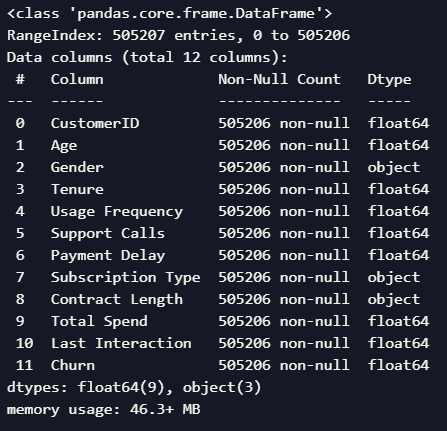
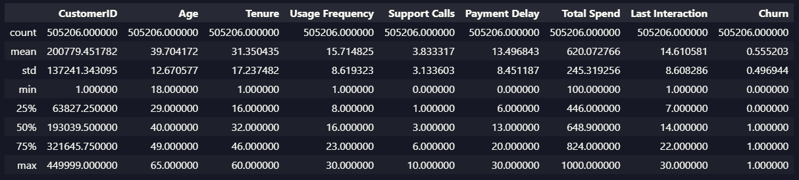
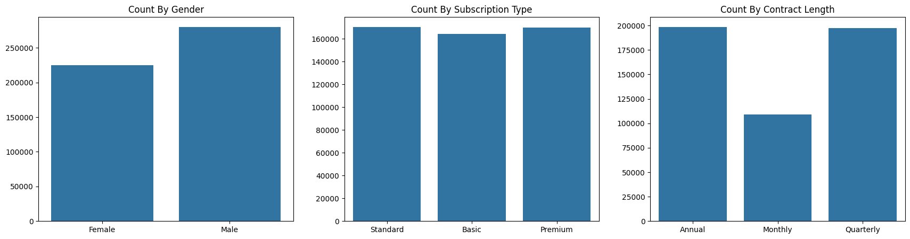
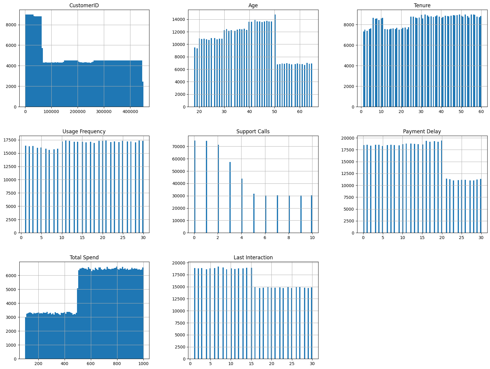
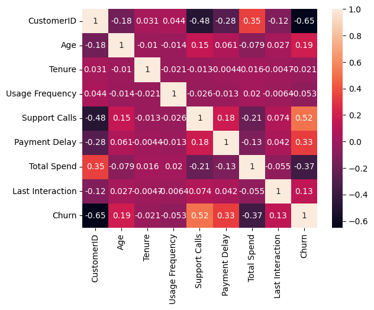

# Laporan Proyek Machine Learning - Maulana Surya Negara

## Domain Proyek

Churn pelanggan merujuk pada fenomena di mana pelanggan menghentikan hubungan atau langganan mereka dengan perusahaan atau penyedia layanan. Tingkat churn pelanggan berdampak langsung pada pendapatan, pertumbuhan, dan retensi pelanggan perusahaan. Oleh karena itu, memahami dan mengurangi churn pelanggan adalah prioritas utama bagi banyak bisnis

Misalnya, dalam industri telekomunikasi, pelanggan mungkin memilih untuk berhenti berlangganan jika mereka merasa tidak puas dengan kualitas layanan, menemukan penawaran yang lebih baik dari pesaing, atau merasa bahwa biaya langganan mereka tidak sebanding dengan nilai yang mereka terima. Dalam kasus seperti ini, perusahaan dapat kehilangan pendapatan signifikan dan mungkin harus mengeluarkan biaya tambahan untuk memperoleh pelanggan baru.

Dengan melakukan analisis prediksi churn, perusahaan dapat mengidentifikasi pelanggan yang berisiko churn dan mengambil tindakan proaktif untuk mempertahankan mereka. Misalnya, mereka mungkin menawarkan diskon atau peningkatan layanan untuk meningkatkan kepuasan pelanggan dan mencegah mereka berhenti berlangganan. Oleh karena itu, analisis prediksi churn adalah alat yang sangat berharga untuk mempertahankan pelanggan dan meningkatkan kinerja bisnis [^1^].

[^1^]: [Ahmadi, T., Wulandari, A., & Suhatman, H. Sistem Customer Churn Prediction Menggunakan Machine Learning pada Perusahaan ISP.](https://repository.pnj.ac.id/id/eprint/14345/3/JURNAL.pdf

## Business Understanding

### Problem Statements

- Perusahaan mengalami tingkat churn pelanggan yang tinggi, yang berdampak negatif pada pendapatan dan pertumbuhan mereka.
- Perusahaan saat ini tidak memiliki cara untuk mengidentifikasi pelanggan yang berisiko churn.
- Tanpa kemampuan untuk memprediksi churn, perusahaan tidak dapat mengambil tindakan proaktif untuk mempertahankan pelanggan.

### Goals

- Membangun model prediktif yang dapat memprediksi churn pelanggan dengan akurasi di atas 85%.
- Mengidentifikasi fitur-fitur yang paling berkontribusi terhadap churn pelanggan.
- Menggunakan model untuk mengidentifikasi pelanggan yang berisiko churn.
- Mengambil tindakan proaktif berdasarkan prediksi model untuk mempertahankan pelanggan dan mengurangi churn.
- Meningkatkan retensi pelanggan dan, pada akhirnya, pendapatan dan pertumbuhan perusahaan.

## Data Understanding

Data yang digunakan pada proyek kali ini adalah data yang diambil dari <a href='https://www.kaggle.com/datasets/muhammadshahidazeem/customer-churn-dataset/data' target='_blank'>Kaggle</a>. Trainning file untuk dataset CHURN berisi kumpulan 505207 record pelanggan beserta fitur dan label churn mereka masing-masing. File ini berfungsi sebagai sumber utama untuk melatih model machine learning untuk memprediksi churn pelanggan. Setiap record dalam file training mewakili pelanggan dan mencakup fitur seperti CustomerID, Age Gender, Tenure, Usage Frequency, Support Calls, Payment Delay, Subscription Type, Contract Length, Total Spend, dan Last Interaction. Label churn menunjukkan apakah pelanggan telah churn (1) atau tidak (0). Dengan memanfaatkan file pelatihan ini, bisnis dapat mengembangkan model prediksi churn yang akurat untuk mengidentifikasi pelanggan yang paling mungkin untuk churn dan mengambil tindakan proaktif untuk mempertahankannya.

### Deskripsi Data

Berdasarkan informasi dari Kaggle, variabel-variabel pada Diamond dataset adalah sebagai berikut:

- `CustomerID`: ID unik untuk setiap pelanggan.
- `Age`: Usia pelanggan dengan rentang 18-65 tahun.
- `Gender`: Jenis kelamin pelanggan (Pria/Wanita).
- `Tenure`: Masa aktif pelanggan dengan rentang 1-60 bulan.
- `Usage Frequency`: Frekuensi penggunaan layanan dengan rentang 1-30 kali.
- `Support Calls`: Jumlah panggilan dukungan pelanggan dengan rentang 0-10 panggilan.
- `Payment Delay`: Jumlah hari keterlambatan pembayaran dengan rentang 0-30 hari.
- `Subscription Type`: Tipe langganan pelanggan seperti standar, basic, dan premium.
- `Contract Length`: Tipe kontrak pelanggan seperti bulanan, tahunan, dan 3 tahunan.
- `Total Spend`: Total pengeluaran pelanggan dalam dolar.
- `Last Interaction`: Waktu interaksi terakhir dengan pelanggan dalam hari.
- `Churn`: Label churn pelanggan (1: churn, 0: tidak churn).

Dari `info()` didapatkan informasi bahwa:

- Terdapat 3 kolom bertipe data `object` yaitu `Contract Length`, `Gender`, dan `Subscription Type`.
- Terdapat 8 kolom bertipe data `float` yaitu `CustomerID`, `Age`, `Tenure`, `Usage Frequency`, `Support Calls`, `Payment Delay`, `Total Spend`, `Last Interaction`, dan `Churn`.
- Terdapat 2 variabel yang bertipe data tidak sesuai, yaitu `Churn` dan `CustomerID`. Variabel `Churn` seharusnya bertipe data boolean atau dapat juga integer karena true/false akan diwakilkan oleh 1/0, sedangkan variabel `CustomerID` sedangkan variabel `CustomerID` seharusnya bertipe data string. Akan tetapi, variabel `CustomerID` tidak akan digunakan dalam proses analisis data, sehingga tidak perlu diubah tipe datanya.

Dari `describe()` dapat diketahui informasi sebagai berikut:

- Count: Jumlah data pada setiap kolom.
- Mean: Rata-rata dari setiap kolom.
- Std: Standar deviasi dari setiap kolom.
- Min: Nilai minimum dari setiap kolom.
- 25%: Kuartil pertama dari setiap kolom.
- 50%: Median dari setiap kolom.
- 75%: Kuartil ketiga dari setiap kolom.
- Max: Nilai maksimum dari setiap kolom.

Dengan min, max, median, dan mean dari setiap kolom dapat diketahui tidak ada nilai yang jauh dari nilai rata-rata, sehingga dapat disimpulkan bahwa tidak ada outlier pada dataset.

### Univariate Analysis

Dari hasil analisis univariate pada categorical features di atas, dapat diamati bahwa:

- Pada countplot dari variabel `Gender`, terlihat bahwa jumlah pelanggan laki-laki lebih banyak dibandingkan dengan pelanggan perempuan.
- Pada countplot dari variabel `Subscription Type`, terlihat bahwa sebaran pelanggan relatif merata pada masing-masing tipe subscription.
- Pada countplot dari variabel `Contract Length`, terlihat bahwa pelanggan lebih banyak yang memiliki kontrak tahunan dan triwulanan dibandingkan dengan kontrak bulanan.

Dari hasil analisis univariate pada numerical features di atas, dapat diamati bahwa:
- Pada histogram dari variabel `Age`, terlihat bahwa sebagian besar pelanggan berusia antara 20-50 tahun.
- Pada histogram dari variabel `Tenure` dan `Usage Frequency`, terlihat bahwa sebaran pelanggan relatif merata.
- Pada histogram dari variabel `Support Calls` terlihat bahwa sebagian besar pelanggan melakukan panggilan dukungan kurang dari 5 kali.
- Pada histogram dari variabel `Payment Delay`, terlihat bahwa sebagian besar pelanggan melakukan keterlambatan pembayaran kurang dari 20 hari.
- Pada histogram dari variabel `Total Spend`, terlihat bahwa sebagian besar pelanggan mengeluarkan biaya lebih dari 500 dolar.
- Pada histogram dari variabel `Last Interaction`, terlihat bahwa sebaran pelanggan relatif merata.

### Multivariate Analysis

Pada analisis multivariate, akan dilakukan analisis korelasi antar variabel pada dataset. Hal ini dilakukan untuk mengetahui korelasi antar variabel pada dataset sehingga dapat diketahui variabel mana saja yang memiliki korelasi tinggi dengan label churn.

Dari diagram heatmap korelasi di atas, dapat diamati bahwa:
- Hanya variabel `Support Calls` yang memiliki korelasi moderat dengan label churn.
- Variabel `Age`, `Payment Delay`, `Last Interaction`,dan `Total Spend` memiliki korelasi rendah dengan label churn.
- Sedangkan variabel `Tenure` dan `Usage Frequency` memiliki korelasi mendekati nol dengan label churn.

Pada kasus kali ini, karena model yang akan digunakan adalah deep learning, maka tidak variabel yang memiliki korelasi rendah dengan label churn tidak dihapus. Hal ini karena deep learning dapat memberikan weight yang tepat untuk setiap variabel sehingga tidak perlu melakukan feature selection.

## Data Preparation

Pada tahap ini, perlu dilakukan beberapa proses untuk mempersiapkan data sebelum dilakukan pemodelan. Proses-proses tersebut antara lain:

- Melakukan pengecekan terhadap tipe data dari setiap kolom pada dataset. Hal ini dilakukan untuk memastikan bahwa tipe data dari setiap kolom sudah sesuai dengan yang diharapkan.
- Melakukan pengecekan terhadap missing value pada dataset. Hal ini dilakukan untuk memastikan bahwa tidak ada missing value pada dataset.
- Melakukan pengecekan terhadap duplikasi data pada dataset. Hal ini dilakukan untuk memastikan bahwa tidak ada duplikasi data pada dataset.
- Melakukan pengecekan terhadap outlier pada dataset dengan menggunakan describe statistics. Hal ini dilakukan untuk memastikan bahwa tidak ada outlier pada dataset sehingga tidak mempengaruhi hasil dari model machine learning yang akan dibuat.
- Mengatasi missing value pada dataset. Hal ini dilakukan dengan cara mengisi missing value dengan nilai yang sesuai atau menghapus baris yang memiliki missing value karena jumlah missing value yang sedikit.
- Melakukan pengecekan terhadap korelasi antar variabel pada dataset. Hal ini dilakukan untuk mengetahui korelasi antar variabel pada dataset sehingga dapat diketahui variabel mana saja yang memiliki korelasi tinggi dengan label churn.
- Menghapus kolom yang tidak diperlukan dan yang memiliki korelasi sangat rendah dengan label churn. Hal ini dilakukan untuk mempercepat proses pemodelan dan mengurangi kompleksitas model.
- Melakukan encoding terhadap kolom-kolom kategorikal pada dataset. Hal ini dilakukan untuk mengubah tipe data dari kolom-kolom kategorikal menjadi numerik sehingga dapat digunakan pada model machine learning.
- Melakukan split data menjadi data train, test, dan validation. Hal ini dilakukan untuk membagi data menjadi data train, test, dan validation dengan proporsi tertentu sehingga dapat digunakan untuk melatih model, menguji model, dan mengevaluasi model.

## Modeling

Pada proyek ini, akan digunakan model machine learning tensorflow dengan arsitektur deep learning. Hal ini karena deep learning mampu mempelajari pola yang kompleks dari data dan menghasilkan prediksi yang akurat. Model ini terdiri dari 1024 neuron, layer kedua terdiri dari 512 neuron, dan layer terakhir terdiri dari 1 neuron. Model ini menggunakan fungsi aktivasi relu pada layer pertama dan kedua, karena relu merupakan fungsi aktivasi yang paling umum digunakan pada hidden layer. Sedangkan pada layer terakhir menggunakan fungsi aktivasi sigmoid, karena sigmoid merupakan fungsi aktivasi yang paling umum digunakan pada output layer untuk klasifikasi biner.

Selanjutnya, model akan di compile dengan optimizer adam, loss function binary crossentropy, dan metrics accuracy. Optimizer adam merupakan optimizer yang paling umum digunakan pada deep learning karena dapat melakukan penyesuaian learning rate secara otomatis. Loss function binary crossentropy merupakan loss function yang paling umum digunakan pada klasifikasi biner. Metrics accuracy digunakan untuk mengukur performa model.

Proses hyperparameter tuning akan dilakukan dengan menggunakan intuisi dan eksperimen. Hal ini dilakukan untuk mencari hyperparameter yang paling optimal sehingga dapat menghasilkan model yang akurat. Beberapa hyperparameter yang akan di tuning antara lain optimizer, jumlah neuron pada hidden layer, jumlah hidden layer, epoch, dan batch size.

## Evaluation

Model akan dievaluasi dengan menggunakan validation dataset. Hal ini dilakukan untuk mengukur performa model pada data yang belum pernah dilihat sebelumnya. Model akan dievaluasi dengan menggunakan metrics accuracy. Sehingga didapatkan hasil akhir dari model yang telah dibuat yaitu 0.9155 pada train accuracy, 0.9193 pada test accuracy, dan 0.9160 pada val accuracy. Hal ini menunjukkan bahwa model yang telah dibuat memiliki performa yang baik sehingga tidak terjadi overfitting maupun underfitting.
